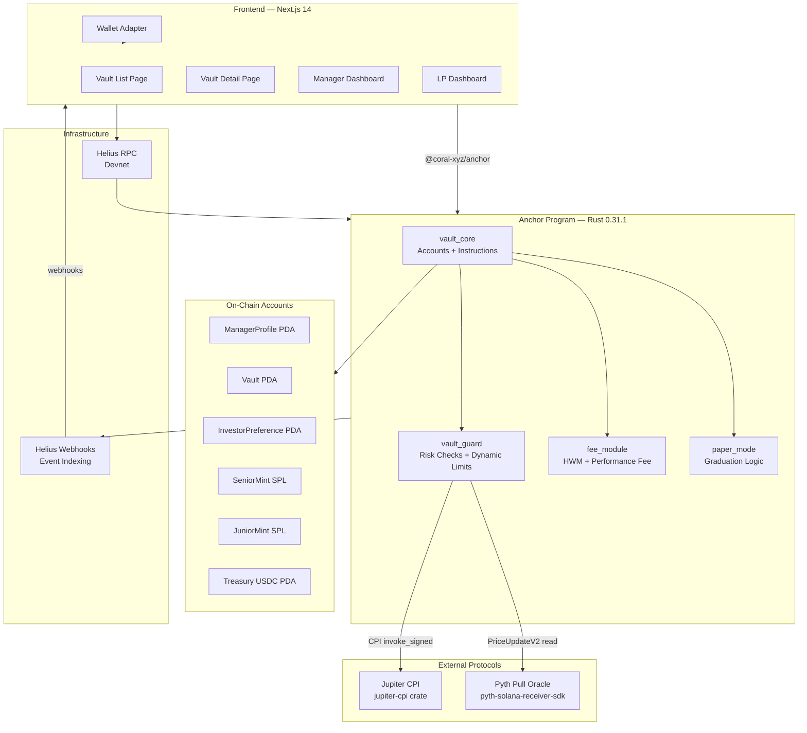
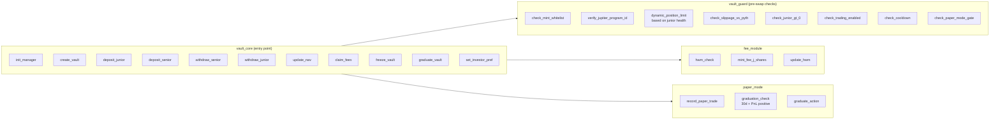
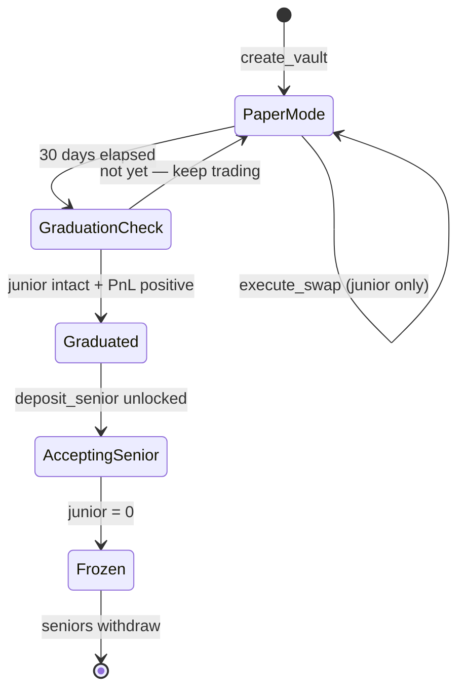
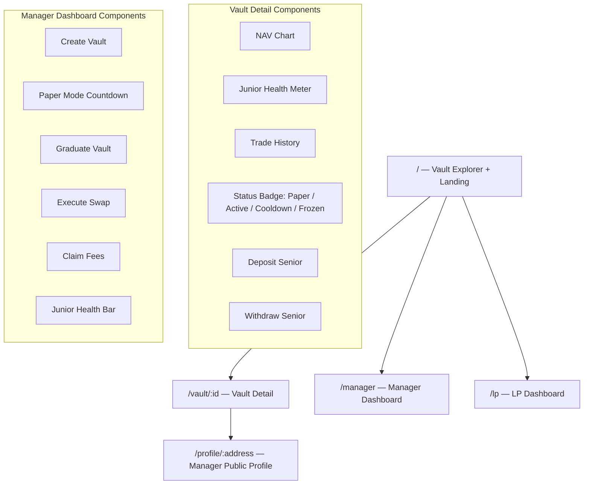

# Kiln — System Architecture Document
> Version 1.1 | Includes all patched incentive mechanics

---

## 1. Tech Stack

| Layer | Tool | Version / Notes |
|---|---|---|
| Smart Contract | Rust + Anchor | **0.31.1** (latest stable, Pyth-compatible) |
| Solana CLI | Agave CLI | 2.1.0+ (`solana-install` deprecated, use agave) |
| Frontend | Next.js 14 + TypeScript + Tailwind | App router |
| Wallet | Solana Wallet Adapter | Phantom / Backpack |
| Oracle | Pyth Network | Pull oracle — `pyth-solana-receiver-sdk` |
| Swap | Jupiter CPI | `jupiter-cpi` crate — CPI recommended Jan 2025 |
| RPC | Helius | Devnet for MVP |
| Token Standard | SPL Token | USDC as base mint |
| Indexer | Helius Webhooks | Real-time event indexing for frontend |
| Deploy | Devnet | Verifiable builds via `anchor build --verifiable` |

---

## 2. High-Level System Architecture



---

## 3. Program Module Breakdown



---

## 4. Account Structure

### `Vault` Account
```rust
#[account]
pub struct Vault {
    pub manager: Pubkey,
    pub base_mint: Pubkey,              // USDC
    pub senior_mint: Pubkey,
    pub junior_mint: Pubkey,
    pub treasury: Pubkey,               // USDC PDA

    // Accounting
    pub junior_capital: u64,
    pub senior_capital: u64,
    pub junior_shares: u64,
    pub senior_shares: u64,
    pub original_junior_deposit: u64,   // for dynamic position limits

    // Config (sliding scale by TVL — not hardcoded)
    pub max_slippage_bps: u16,          // 50 = 0.5%
    pub allowed_mints: [Pubkey; 8],
    pub tier: u8,                       // 1=spot only, 2=perps (future)

    // State
    pub trading_enabled: bool,
    pub is_paper_mode: bool,
    pub graduated: bool,
    pub graduated_at: i64,
    pub high_water_mark: u64,
    pub last_nav: u64,

    // Cooldown tracking
    pub last_loss_timestamp: i64,
    pub rolling_24h_loss_bps: u16,
    pub rolling_7d_loss_bps: u16,
    pub cooldown_until: i64,

    pub bump: u8,
}
```

### `ManagerProfile` Account
```rust
#[account]
pub struct ManagerProfile {
    pub owner: Pubkey,
    pub created_at: i64,
    pub total_pnl: i64,
    pub junior_burned: u64,
    pub vaults_count: u8,
    pub bump: u8,
}
```

### `InvestorPreference` Account (new)
```rust
#[account]
pub struct InvestorPreference {
    pub investor: Pubkey,
    pub vault: Pubkey,
    pub alert_threshold_bps: u16,  // alert if junior ratio drops below X%
    pub deposited_at: i64,
    pub bump: u8,
}
```

---

## 5. Patched Mechanics

### 5.1 Dynamic Position Limits

Every `execute_swap` computes junior health before running:

```
junior_health_bps = (junior_capital * 10000) / original_junior_deposit

health > 8000  → max_position_bps = 1000   (10% of NAV)
health 5000-8000 → max_position_bps = 600  (6%)
health 3000-5000 → max_position_bps = 300  (3%)
health 1000-3000 → max_position_bps = 100  (1%)
health < 1000  → trading_enabled = false   (freeze)
```

Pure on-chain math. No oracle. One extra field on Vault account.

---

### 5.2 Paper Mode → Graduation Flow



`deposit_senior` requires: `vault.graduated == true`

`graduate_vault` requires: 30 days elapsed + `junior_capital > 0` + `last_nav > original_junior_deposit`

---

### 5.3 Sliding Scale Junior Ratio

```
total_capital < 50k USDC    → min_junior_ratio = 20%
50k – 200k USDC             → min_junior_ratio = 15%
200k – 500k USDC            → min_junior_ratio = 12%
500k – 1M USDC              → min_junior_ratio = 10%
> 1M USDC                   → min_junior_ratio = 8% (floor)
```

Pure function in `deposit_senior`. No new account needed.

---

### 5.4 Trade Cooldowns

```
Single trade NAV drop > 3%   → cooldown 2 hours
Rolling 24h NAV drop > 7%    → cooldown 24 hours
Rolling 7d NAV drop > 15%    → cooldown 72 hours + emit alert
```

Stored in `vault.cooldown_until`. Every `execute_swap` checks:
`require!(now >= vault.cooldown_until, ErrorCode::VaultInCooldown)`

---

### 5.5 Instant Senior Withdrawal at Low Junior

```
Normal:              24h cooldown before withdrawal
Junior ratio < 20%:  cooldown = 0 (instant)
                     emit!(JuniorBufferLowAlert)
```

---

### 5.6 On-Chain Events (for Helius webhook indexing)

```rust
emit!(JuniorHealthChanged { vault, old_ratio, new_ratio, timestamp });
emit!(CooldownEntered { vault, cooldown_until, reason });
emit!(VaultFrozen { vault, timestamp });
emit!(NAVUpdated { vault, old_nav, new_nav, timestamp });
emit!(VaultGraduated { vault, manager, paper_pnl });
emit!(JuniorBufferLowAlert { vault, ratio_bps });
```

---

## 6. Instruction Table

| Instruction | Who | Key Guards |
|---|---|---|
| `init_manager` | Trader | — |
| `create_vault` | Trader | — |
| `deposit_junior` | Trader | Paper mode OK |
| `deposit_senior` | Investor | `graduated`, sliding ratio, min $10 USDC |
| `withdraw_senior` | Investor | 24h cooldown OR instant if junior < 20% |
| `withdraw_junior` | Trader | Ratio must stay ≥ min after withdrawal |
| `execute_swap` | Trader | Full guard suite: whitelist, Jupiter ID, dynamic limits, slippage, cooldown |
| `update_nav` | Anyone | Pyth staleness < 60s |
| `claim_fees` | Trader | HWM check, graduated only |
| `freeze_vault` | Auto | Triggered in `update_nav` and `execute_swap` |
| `graduate_vault` | Anyone | 30d + PnL > 0 + junior intact |
| `set_investor_pref` | Investor | — |

---

## 7. Jupiter CPI Notes

> CPI is the recommended method as of January 2025 (Loosen CPI restriction deployed).

```toml
# Cargo.toml
jupiter-cpi = { git = "https://github.com/jup-ag/jupiter-cpi", rev = "5eb8977" }
```

Always observe vault delta post-swap (Token-2022 safe — never trust instruction amount):
```rust
let before = vault_treasury.amount;
// CPI call
vault_treasury.reload()?;
let received = vault_treasury.amount - before;
require!(received >= minimum_out, ErrorCode::SlippageExceeded);
```

Use `remaining_accounts` for Jupiter's dynamic account list. Set `maxAccounts` on quote API to stay within 1232-byte tx limit.

---

## 8. Pyth Oracle Notes

> Use pull oracle model. Compatible with Anchor 0.31.1.

```toml
pyth-solana-receiver-sdk = "x.y.z"  # check crates.io for latest
```

Staleness check in every NAV update:
```rust
let price = price_update.get_price_no_older_than(
    &Clock::get()?,
    60,   // max 60 seconds stale
    &get_feed_id_from_hex(FEED_ID)?
)?;
// Stale → ErrorCode::OracleStale → block trade
```

Use `PriceUpdateV2` account. Pass feed address from frontend via `@pythnetwork/pyth-solana-receiver`.

---

## 9. NAV Math Reference

```
// Share pricing
senior_share_price = senior_capital / senior_shares
junior_share_price = junior_capital / junior_shares

// Deposit
shares_minted = deposit_amount / share_price

// Waterfall on loss
loss = previous_nav - current_nav
if loss <= junior_capital:
    junior_capital -= loss
else:
    senior_capital -= (loss - junior_capital)
    junior_capital = 0
    trading_enabled = false
    emit!(VaultFrozen)

// Dynamic position limit
junior_health_bps = (junior_capital * 10000) / original_junior_deposit
max_trade = (total_nav * dynamic_limit(junior_health_bps)) / 10000

// Sliding ratio check
min_ratio_bps = sliding_ratio(total_nav)
current_ratio = (junior_capital * 10000) / total_nav
require!(current_ratio >= min_ratio_bps)

// Performance fee
if current_nav > hwm:
    profit = current_nav - hwm
    fee_usdc = profit * 20 / 100
    fee_j_shares = fee_usdc / junior_share_price
    mint fee_j_shares to manager
    hwm = current_nav
```

---

## 10. Frontend Page Map



---

## 11. 4-Week Build Plan

### Week 1 — Skeleton + Accounts
- Anchor 0.31.1 project init
- `ManagerProfile`, `Vault`, `InvestorPreference` account structs
- USDC treasury PDA
- Junior + Senior SPL mint init
- `init_manager`, `create_vault`, `deposit_junior`
- Paper mode flag + `original_junior_deposit` field
- Unit tests for all account init

**Goal:** Junior deposit works end-to-end on localnet.

---

### Week 2 — Accounting + Withdrawals + Graduation
- Waterfall loss logic (pure math, no oracle)
- `update_nav` with Pyth pull oracle + staleness check
- Sliding scale ratio enforcement in `deposit_senior`
- `withdraw_senior` (24h cooldown + instant-if-low)
- `withdraw_junior` with ratio guard
- `graduate_vault` (30d + PnL check)
- HWM tracking + `claim_fees`
- Auto-freeze when junior = 0
- All `emit!()` events wired
- Edge case tests: dust, min deposit, junior wipe, oracle stale

**Goal:** Full vault lifecycle without trades. Paper + graduation flow tested.

---

### Week 3 — Trading Layer + Vault Guard
- Vault Guard module (all 8 checks)
- Dynamic position limits (junior health ratio)
- Trade cooldown tracking + enforcement
- `execute_swap` with Jupiter CPI (`remaining_accounts` pattern)
- Vault delta observation post-swap
- Pyth adapter for slippage check
- NAV recomputation post-trade
- Integration tests on devnet with real Jupiter swaps

**Goal:** Trader executes real swaps with all guards active on devnet.

---

### Week 4 — Frontend + Demo + Submit
- Next.js app skeleton + Wallet Adapter
- Vault list with health badges + status
- Vault detail (NAV chart, health meter, trade history)
- Manager dashboard (all actions)
- LP dashboard (deposit, withdraw, alert threshold)
- Helius webhook → real-time UI updates
- Seed demo vaults:
  - **Vault A (Profit):** Graduation → profitable trades → fee crystallization
  - **Vault B (Loss):** Limits tighten → junior burns → LP safe → instant withdraw
- 3-minute demo video
- README + this architecture doc

**Goal:** Submission-ready.

---

## 12. Demo Script

### Vault B — The Core Pitch (Loss)
```
$100k total | $20k junior | $80k senior | Graduated

Trade 1: SOL/USDC loss → junior drops to $15k (75% health)
  UI: position limit drops from 10% → 6%

Trade 2: Another loss → junior at $6k (30% health)
  UI: position limit drops to 1%, instant withdrawal badge appears

Trade 3: Final loss → junior hits 0
  UI: vault FROZEN banner, senior balance still $80k
  LP clicks withdraw → gets $80k back instantly

Single screen: senior unchanged. Manager loses everything first.
```

### Vault A — The Upside (Profit)
```
$100k → $125k via spot trades
Fee: $5k → minted as J-shares to manager
HWM: updates to $125k
UI: manager's J-share count ticks up, NAV chart climbs
```
