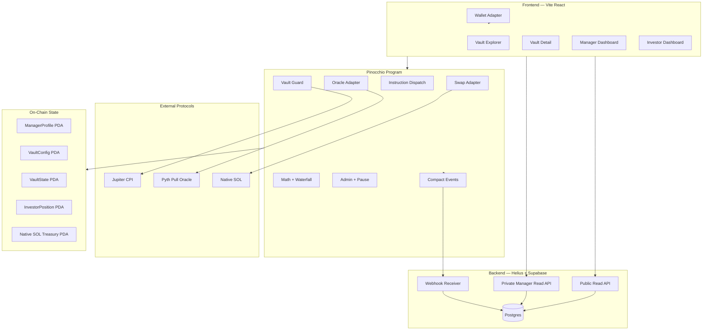
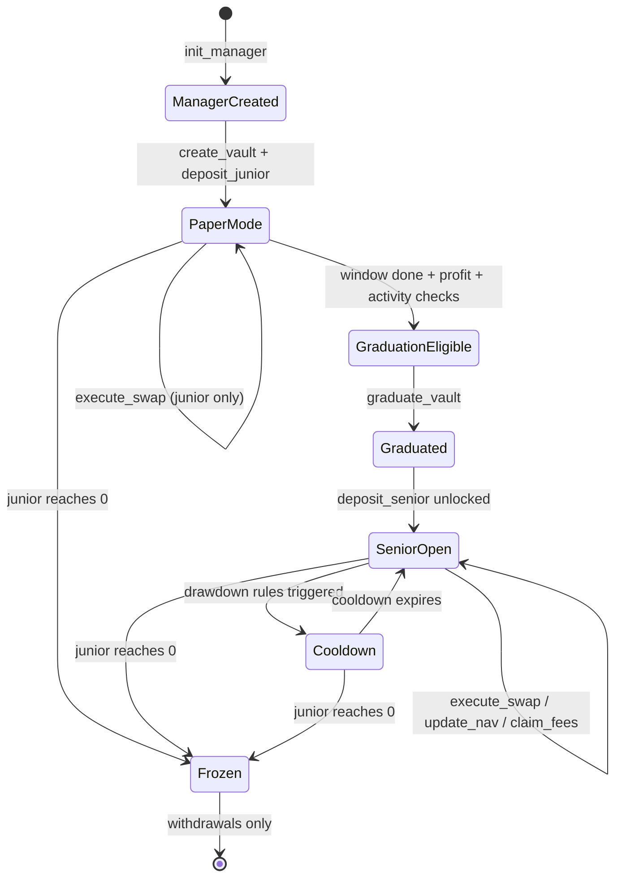
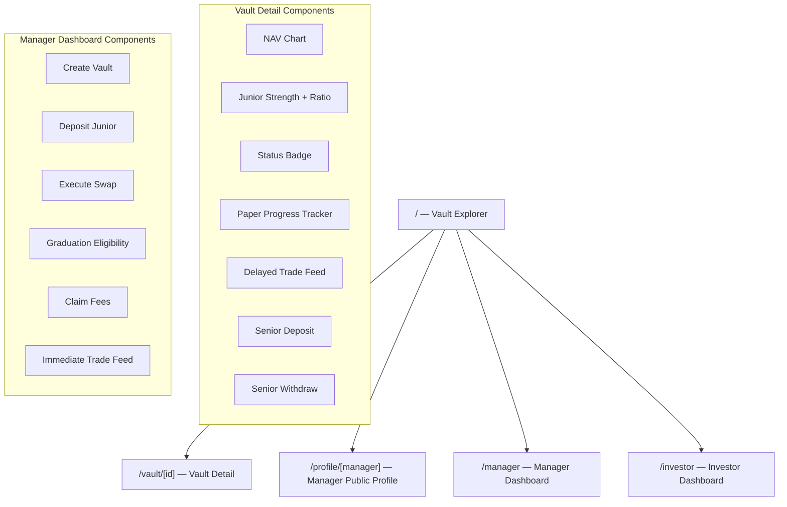

# Kiln — System Architecture Document (v2)
> Version 2.1 | Devnet-ready Pinocchio architecture | SOL-only MVP

---

## 1. Tech Stack

| Layer | Tool | Version / Notes |
|---|---|---|
| Smart Contract | Rust + Pinocchio | `pinocchio`, `pinocchio-system`, `pinocchio-token` |
| Account Layout | `bytemuck` | Fixed-size zero-copy accounts only |
| Instruction Encoding | `wincode` | In-place instruction serialization / deserialization |
| IDL | `Shank` | IDL generation for client typing |
| Solana CLI | Agave / Solana CLI | `cargo build-sbf`, devnet deployment |
| Frontend | Vite + React + TypeScript + Tailwind | React Router |
| Wallet | Solana Wallet Adapter | Phantom / Backpack |
| Oracle | Deferred | SOL-only MVP uses treasury lamports for NAV; Pyth is required before adding non-SOL assets |
| Swap | Deferred | No Jupiter CPI in the SOL-only MVP; paper trades must not count until real CPI lands |
| RPC | Helius | Devnet RPC |
| Token Standard | Native SOL | SPL USDC is a post-MVP migration, not active on this branch |
| Indexer | Helius Webhooks | Event ingestion |
| Backend | Supabase / Postgres | NAV points, status events, delayed trade visibility |
| Deploy | Devnet | Demo-first deployment target |

---

## 2. High-Level System Architecture



---

## 3. Program Module Breakdown

```mermaid
graph LR
    subgraph dispatch["dispatch"]
        IM[init_manager]
        CV[create_vault]
        DJ[deposit_junior]
        DS[deposit_senior]
        WJ[withdraw_junior]
        WS[withdraw_senior]
        UN[update_nav]
        GV[graduate_vault]
        ES[execute_swap]
        CF[claim_fees]
        SIP[set_investor_position]
        PV[pause_vault]
        UV[unpause_vault]
        PA[propose_admin]
        AA[accept_admin]
    end

    subgraph guard["vault_guard"]
        WM[check_whitelist]
        BR[check_base_routed_pair]
        JP[check_jupiter_program]
        TE[check_trading_enabled]
        CD[check_cooldown]
        PS[check_position_size]
        SG[check_slippage_guard]
        PG[check_paper_or_graduated_state]
    end

    subgraph math["math"]
        NAV[compute_nav]
        WL[apply_waterfall_loss]
        HS[compute_health_metrics]
        SR[sliding_ratio]
        FE[fee_math]
    end

    subgraph state["state + codecs"]
        VCFG[VaultConfig]
        VST[VaultState]
        MGR[ManagerProfile]
        POS[InvestorPosition]
    end

    subgraph infra["infra"]
        OA[oracle_adapter]
        SA[swap_adapter]
        EV[events]
        AD[admin]
    end

    dispatch --> guard
    dispatch --> math
    dispatch --> state
    dispatch --> infra
```



---

## 4. Account Structure

Pinocchio does not give Anchor-style account wrappers. All accounts are validated manually in a fixed order:
1. account key check where applicable
2. owner check
3. signer check
4. writable check
5. discriminator check
6. field-level validation

All Kiln state accounts are fixed-size, zero-copy, and `#[repr(C)]`. No dynamic strings or vectors are stored on-chain.

### `VaultConfig`

Purpose: slow-changing configuration and static addresses.

```rust
#[repr(C)]
#[derive(Clone, Copy, Pod, Zeroable, ShankAccount)]
pub struct VaultConfig {
    pub discriminator: u8,
    pub manager: Pubkey,
    pub admin_authority: Pubkey,
    pub pending_admin: Pubkey,

    pub treasury: Pubkey,          // native SOL PDA

    pub trade_authority_pda: Pubkey,

    pub paper_window_secs: i64,
    pub min_qualifying_trades: u16,
    pub qualifying_trade_bps: u16,    // e.g. 500 = 5% of original junior deposit
    pub max_slippage_bps: u16,        // e.g. 50 = 0.5%
    pub emergency_exit_ratio_bps: u16,// e.g. 2000 = 20%

    pub manager_bump: u8,
    pub vault_config_bump: u8,
    pub vault_state_bump: u8,
    pub trade_authority_bump: u8,
    pub _padding: [u8; 5],
}
```

Notes:
- `paper_window_secs` is config-driven so devnet can run a shorter window than the production-target rule.
- `pending_admin` is zeroed when no admin rotation is active.
- SPL mints and allowlists are post-MVP additions.

### `VaultState`

Purpose: hot mutable accounting and lifecycle state.

```rust
#[repr(C)]
#[derive(Clone, Copy, Pod, Zeroable, ShankAccount)]
pub struct VaultState {
    pub discriminator: u8,

    pub original_junior_deposit: u64,
    pub junior_capital: u64,
    pub senior_capital: u64,

    pub junior_shares_outstanding: u64,
    pub senior_shares_outstanding: u64,

    pub current_nav: u64,
    pub last_nav: u64,
    pub high_water_mark: u64,

    pub paper_trade_count: u16,
    pub created_at: i64,
    pub graduated_at: i64,
    pub cooldown_until: i64,
    pub last_loss_timestamp: i64,
    pub last_nav_update_at: i64,

    pub rolling_24h_loss_bps: u16,
    pub rolling_7d_loss_bps: u16,

    pub is_paper_mode: u8,
    pub is_graduated: u8,
    pub is_paused: u8,
    pub trading_enabled: u8,
    pub _padding: [u8; 3],
}
```

Notes:
- `u8` flags are used instead of `bool` to keep layout explicit.
- `current_nav` is tracked in lamports for the SOL-only MVP.
- `paper_trade_count` only counts qualifying real swaps; while Jupiter CPI is deferred, no-op swap attempts must not increment it.

### `ManagerProfile`

Purpose: manager identity and track-record foundation for MVP.

```rust
#[repr(C)]
#[derive(Clone, Copy, Pod, Zeroable, ShankAccount)]
pub struct ManagerProfile {
    pub discriminator: u8,
    pub owner: Pubkey,
    pub vault_pubkey: Pubkey,

    pub created_at: i64,
    pub total_pnl_lamports: i64,
    pub junior_burned_lamports: u64,

    pub paper_vaults_completed: u16,
    pub graduated_vaults_completed: u16,
    pub successful_trade_days: u16,

    pub bump: u8,
    pub _padding: [u8; 5],
}
```

Notes:
- There is **no full reputation score** in MVP.
- This account is the base for future reputation, but not the full ladder.

### `InvestorPosition`

Purpose: investor-specific protocol metadata.

```rust
#[repr(C)]
#[derive(Clone, Copy, Pod, Zeroable, ShankAccount)]
pub struct InvestorPosition {
    pub discriminator: u8,
    pub investor: Pubkey,
    pub vault: Pubkey,

    pub deposited_at: i64,
    pub alert_threshold_bps: u16,
    pub bump: u8,
    pub _padding: [u8; 4],
}
```

Notes:
- Senior shares are tracked in protocol state for the SOL-only MVP.
- This account stores senior share, deposit, cooldown, and alert metadata.

---

## 5. Core Metrics

### `current_nav`
Total SOL-denominated value of the vault treasury in the current MVP.

```
current_nav = treasury_lamports - treasury_rent_reserve
```

### `paper_pnl`

```
paper_pnl = current_nav - original_junior_deposit
```

Used only during paper mode because only junior capital exists before graduation.

### `junior_strength_bps`

```
junior_strength_bps =
    junior_capital * 10_000 / original_junior_deposit
```

- uncapped
- can go above `10_000`
- useful for UI and long-term manager analytics

Example:
- start with `10 SOL`
- grow to `14 SOL`
- `junior_strength_bps = 14,000` = `140%`

### `effective_health_bps`

```
effective_health_bps = min(junior_strength_bps, 10_000)
```

This is used by the risk engine so profitable trading does not automatically unlock bigger and bigger position limits.

### `current_junior_ratio_bps`

```
current_junior_ratio_bps =
    junior_capital * 10_000 / current_nav
```

This is the investor-protection metric.

Example:
- `junior_capital = 15,000`
- `current_nav = 75,000`
- `current_junior_ratio_bps = 2,000` = `20%`

If this ratio drops too low, senior investors get instant-exit protection.

### `qualifying_paper_trade_notional`

```
minimum_qualifying_notional =
    original_junior_deposit * qualifying_trade_bps / 10_000
```

With `qualifying_trade_bps = 500`, a `10 SOL` paper vault must execute at least `0.5 SOL` notionally for the trade to count toward graduation once real swap CPI exists.

---

## 6. Vault Lifecycle



### Stage A — Manager Setup
1. manager creates `ManagerProfile`
2. manager creates a single vault
3. vault begins in paper mode
4. senior deposits are blocked

### Stage B — Paper Trading
1. manager deposits only junior capital
2. manager executes approved spot swaps
3. every qualifying trade updates:
   - NAV
   - paper trade count
   - distinct trade day count
   - health metrics
   - cooldown / freeze logic

### Stage C — Graduation
Graduation is **permissionless to finalize**, not permissionless to control.

That means:
- anyone can submit `graduate_vault`
- the program checks whether the target vault qualifies
- if it qualifies, only that vault flips to graduated
- the caller gains no control, no fees, and no trading rights

Why keep it permissionless:
- no dependency on the manager being online
- bots / indexers can finalize state cleanly
- eligible vaults do not get stuck waiting for a manual button click

### Stage D — Senior Capital Open
After graduation:
- investors may deposit senior capital
- manager continues spot-only trading
- losses still hit junior first

### Stage E — Drawdown / Freeze
If junior capital reaches zero:
- the vault freezes automatically
- further trading stops
- withdrawals remain available

---

## 7. Graduation Rules

### Production-Target Semantics
- paper window target: `30 days`
- positive ending performance
- real activity over time, not one lucky trade

### Devnet MVP Defaults
- `paper_window_secs = 3 days`
- `min_qualifying_trades = 3`
- `qualifying_trade_bps = 500` (5%)

This keeps the product honest while still making live demos practical.

### Final MVP Graduation Gate

`graduate_vault` succeeds only if:
- current time is past `created_at + paper_window_secs`
- vault is still in paper mode
- vault is not paused
- `paper_trade_count >= min_qualifying_trades`
- `paper_pnl > 0`

### Why Health Threshold Is Not The Main Graduation Gate
In paper mode, only junior capital exists.

So if:
- the vault started with `10k`
- it now has `8.5k`

then:
- health is `85%`
- but PnL is negative

Because of that, a separate `85% health` gate is weaker and less meaningful than:
- positive ending NAV
- minimum number of real trades
- minimum number of real trades

So MVP graduation is based on **profit + activity**, not “survived with a little money left.”

---

## 8. Patched Mechanics

### 8.1 Dynamic Position Limits

Use `effective_health_bps`:

```
effective_health_bps >= 10000   -> max_position_bps = 1000  (10%)
8000 - 9999                     -> max_position_bps = 600   (6%)
5000 - 7999                     -> max_position_bps = 300   (3%)
3000 - 4999                     -> max_position_bps = 100   (1%)
< 3000                          -> trading blocked or near-blocked
```

Notes:
- The top band is capped at `100%+`.
- A manager who grows junior strength to `140%` still gets truthful UI display, but not larger-than-top-band trading limits.

### 8.2 Sliding Scale Junior Ratio

```
total_capital < 50k SOL-lamport units    -> min_junior_ratio = 20%
50k - 200k SOL-lamport units             -> min_junior_ratio = 15%
200k - 500k SOL-lamport units            -> min_junior_ratio = 12%
500k - 1M SOL-lamport units              -> min_junior_ratio = 10%
> 1M SOL-lamport units                   -> min_junior_ratio = 8%
```

Applied on:
- `deposit_senior`
- `withdraw_junior`

### 8.3 Junior-First Waterfall

```
loss = previous_nav - current_nav

if loss <= junior_capital:
    junior_capital -= loss
else:
    remaining_loss = loss - junior_capital
    junior_capital = 0
    senior_capital -= remaining_loss
    trading_enabled = false
```

This is the single most important mechanic in Kiln.

### 8.4 Trade Cooldowns

```
Single trade NAV drop > 3%   -> 2h cooldown
Rolling 24h drop > 7%        -> 24h cooldown
Rolling 7d drop > 15%        -> 72h cooldown + alert event
```

Cooldown effect:
- swaps blocked
- withdrawals still allowed

### 8.5 Instant Senior Withdrawal

```
Normal case: 24h cooldown before senior withdrawal
Emergency case: if current_junior_ratio_bps < emergency_exit_ratio_bps, cooldown becomes 0
```

Recommended MVP threshold:
- `emergency_exit_ratio_bps = 2000` = `20%`

### 8.6 Performance Fees

- available only after graduation
- charged only when `current_nav > high_water_mark`
- fee crystallized as additional junior shares to the manager
- `high_water_mark` updates only upward after successful fee crystallization

---

## 9. Instruction Table

| Instruction | Who | Key Guards |
|---|---|---|
| `init_manager` | Trader | one profile per owner |
| `create_vault` | Trader | one vault per manager in MVP |
| `deposit_junior` | Trader | manager only, native SOL transfer into treasury PDA |
| `withdraw_junior` | Trader | post-withdraw junior ratio must remain valid if seniors exist |
| `update_nav` | Anyone | recomputes SOL treasury NAV |
| `graduate_vault` | Anyone | paper window complete, trade minimums, positive paper PnL |
| `deposit_senior` | Investor | vault graduated, min deposit, sliding ratio satisfied |
| `withdraw_senior` | Investor | 24h cooldown or instant if junior ratio below threshold |
| `execute_swap` | Trader | cooldown and size checks; does not count paper trades until real CPI exists |
| `claim_fees` | Trader | graduated only, above HWM |
| `set_investor_position` | Investor | post-MVP; only owner may set alert threshold |
| `pause_vault` | Admin | post-MVP; blocks deposits/swaps only |
| `unpause_vault` | Admin | post-MVP; re-enables allowed operations |
| `propose_admin` | Admin | post-MVP; current admin only |
| `accept_admin` | Pending admin | post-MVP; must match pending admin pubkey |

Only instructions `0..9` are implemented on this branch. Admin rotation, pause controls, and investor alert updates are retained here as near-term architecture, not current ABI.

---

## 10. Jupiter CPI Notes

Jupiter CPI is post-MVP. Until it is implemented, `execute_swap` must not count no-op calls as qualifying paper trades.

### Future Jupiter Is Used Only For Spot Swaps
Future supported pairs:
- `USDC -> SOL`
- `SOL -> USDC`
- `USDC -> JUP`
- `JUP -> USDC`

Not supported in MVP:
- `SOL -> JUP`
- arbitrary token routes
- leverage / perps

### CPI Validation Rules
- hardcode and validate Jupiter program ID
- validate every relevant account in `remaining_accounts`
- pass only the accounts needed for the chosen route
- re-borrow token account data after CPI
- observe actual received balance delta, never trust the quoted instruction amount

### Post-Swap Delta Pattern

```rust
let before = destination_treasury_balance;
// Jupiter CPI
let after = destination_treasury_balance_after_reload;
let actual_received = after - before;
require!(actual_received >= minimum_amount_out, ErrorCode::SlippageExceeded);
```

### Quote Flow
- frontend fetches quote off-chain
- manager submits transaction with quote-derived params
- program re-validates the route class and slippage guard on-chain

---

## 11. Pyth Oracle Notes

Pyth is post-MVP for non-SOL assets. The current SOL-only branch computes NAV from native treasury lamports only.

### Future Pyth Usage
Pyth pull oracle will be used for:
- NAV valuation
- swap slippage sanity checks

### Required Checks
- feed account must match the configured feed in `VaultConfig`
- price must not be older than the freshness threshold
- confidence interval must remain below the configured risk threshold

### Freshness
Recommended future default:
- max staleness: `60 seconds`

### Confidence
Recommended future rule:
- reject oracle values where `conf / price` exceeds a conservative threshold

### NAV Marking
- SOL-only MVP: NAV equals treasury lamports minus rent reserve.
- Future SPL mode: non-SOL balances are converted to the chosen base unit using configured Pyth feeds.

---

## 12. Privacy Model

Kiln MVP uses **soft privacy + UI delay**, not protocol-level confidentiality.

### Public Immediately
- vault status: paper / graduated / cooldown / paused / frozen
- current NAV
- junior strength display
- current junior ratio
- emergency exit state
- aggregate PnL chart

### Delayed In Public UI
- exact trade side
- exact trade size
- exact route details
- exact timestamp

Recommended public visibility delay:
- `12 hours`

### Manager Private View
- manager dashboard sees immediate trade details for that manager's own vault

### Identity Privacy
- public app surfaces use pseudonymous manager labels by default
- investor identities are hidden in the public UI
- wallet addresses and raw on-chain activity remain public to chain analysts

### What MVP Privacy Does Not Claim
- no hidden treasury accounts
- no hidden vault balances
- no hidden transaction graph
- no Confidential Transfers
- no ZK strategy hiding

### Why This Is The Right MVP Privacy Choice
Kiln's trust story depends on public safety signals. If vault health and junior protection become opaque, the product loses its main edge. The most useful privacy here is **protecting trader timing and reducing casual copying**, not hiding everything.

---

## 13. Reputation Model In MVP

Kiln devnet MVP does **not** implement the full reputation system.

### Included
- graduation status
- manager profile
- public performance history
- total PnL tracking
- junior burned / preserved tracking
- freeze and cooldown history

### Not Included
- reputation score
- tier ladder
- slashing formula
- decay formula
- unlocks based on score
- ZK reputation proofs

The architecture should say clearly:
- MVP is about **graduation and visible track record**
- not the full career-ladder reputation engine yet

---

## 14. Backend / Indexer Architecture

### Event Ingestion
Use Helius webhooks to store:
- NAV updates
- graduation events
- cooldown events
- freeze events
- junior/senior deposit summaries
- withdrawal summaries
- fee claim events
- swap execution summaries

### Database Tables

```text
manager_profiles
vault_configs
vault_states
nav_points
trade_events
status_events
investor_positions
```

### Delayed Trade Visibility
Each stored trade row should include:
- `occurred_at`
- `visibility_after`
- `is_public_visible`

Public API:
- returns trade rows only when `now >= visibility_after`

Manager-private API:
- returns immediate trade rows for that manager's vault

### Why Keep A Backend
- faster UI reads than reconstructing everything from RPC
- easier delayed-trade policy
- easier charts, filters, and profile history

---

## 15. Frontend Page Map



---

## 16. 4-Week Build Plan

### Week 1 — Pinocchio Skeleton + State
- Pinocchio project scaffold
- `VaultConfig`, `VaultState`, `ManagerProfile`, `InvestorPosition`
- manual validation helpers
- native SOL treasury PDA setup
- `init_manager`
- `create_vault`
- `deposit_junior`

**Goal:** junior-only paper vault works end-to-end.

### Week 2 — NAV + Graduation + Withdrawals
- NAV math
- permissionless SOL treasury NAV updates
- paper trade counters
- `graduate_vault`
- `deposit_senior`
- `withdraw_senior`
- `withdraw_junior`
- HWM fee math
- freeze logic

**Goal:** full paper-to-graduated lifecycle without polished UI.

### Week 3 — Trading Guard + Indexer
- Jupiter CPI adapter (post-MVP)
- whitelist and base-route guard
- dynamic limits and cooldowns
- webhook ingestion
- delayed trade visibility in backend

**Goal:** real spot trades on devnet with delayed public trade history.

### Week 4 — Frontend + Demo
- public vault explorer
- manager dashboard
- investor dashboard
- seeded profitable vault
- seeded drawdown vault
- demo script + README alignment

**Goal:** demo-ready devnet MVP.

---

## 17. Demo Script

### Demo A — Graduation
1. manager creates vault and deposits junior capital
2. manager completes three qualifying paper trades across three days
3. vault ends profitable
4. any user triggers `graduate_vault`
5. vault unlocks for senior deposits

Key message:
> The trader proved themselves first. Graduation was enforced by code, not trust.

### Demo B — Profit
1. graduated vault accepts senior capital
2. manager executes profitable spot swaps
3. NAV rises
4. HWM fee claim mints additional junior shares to the manager

Key message:
> Winning traders grow both capital and protection buffer.

### Demo C — Drawdown / Safety
1. manager takes losses
2. dynamic position limits tighten
3. junior ratio falls toward emergency threshold
4. investors gain instant withdrawal eligibility
5. if junior hits zero, vault freezes

Key message:
> The trader loses first. Investors are protected by the protocol.

---

## 18. Out Of Scope For MVP

- full reputation score
- multi-vault managers
- Kamino idle yield
- perps / leverage
- Token-2022 support
- Confidential Transfers
- ZK privacy systems
- governance
- mainnet-grade audit and ops process

These remain future work, not hidden assumptions inside the MVP.
