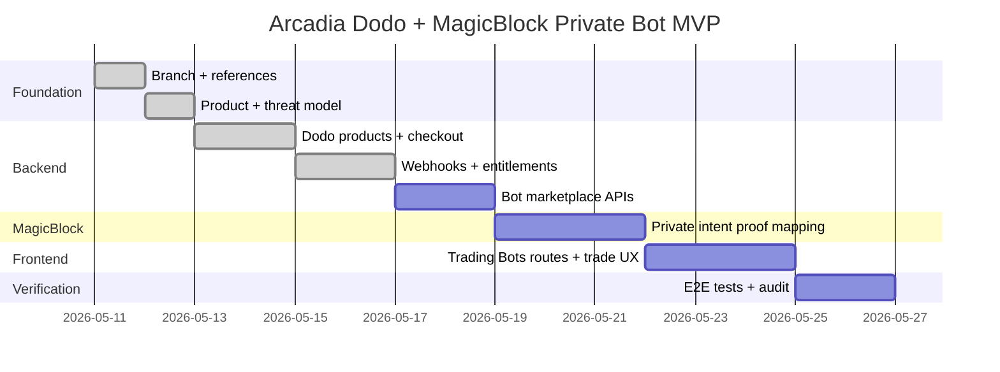

# Arcadia Private Bot Subscriptions — Phase Checklist
> Implementation tracker for Dodo Payments test mode + MagicBlock private strategy bots. Keep this updated as work progresses.

## Status Legend

| Status | Meaning |
|---|---|
| `[ ]` | Not started |
| `[~]` | In progress |
| `[x]` | Done |
| `[!]` | Blocked |

## Milestone Overview

## M0 — Branch, Baseline, And References

- [x] **DMB-000** — Preserve unrelated local edits before implementation
  - Acceptance:
    - `git status -sb` was reviewed.
    - Current implementation branch was created from a clean baseline.
    - No unrelated app files were modified as part of Phase 0.

- [x] **DMB-001** — Choose implementation branch
  - Decision:
    - Created `dodo-payments-bots` from `magicblock`.
  - Acceptance:
    - Branch contains MagicBlock private intent files.
    - Branch contains current frontend/server baseline needed for the app.

- [x] **DMB-002** — Re-read source-of-truth docs before code
  - Required:
    - `context/dodo_magicblock_private_bot_plan.md`
    - `context/arc_v2.md`
    - `context/safe-solana-builder-main/references/shared-base.md`
    - `context/safe-solana-builder-main/references/pinocchio.md`
    - `context/safe-solana-builder-main/references/litesvm.md`
    - MagicBlock skill/doc references
    - Dodo Payments checkout/webhook docs
  - Acceptance:
    - Any implementation PR links back to these docs.

## M1 — Product Model And Threat Model

- [x] **DMB-010** — Define bot marketplace product model
  - Deliverable:
    - Bot listing fields: name, creator wallet, market tags, risk band, proof stats, price, status.
    - Marketplace summary fields: total listed bots, profitable bot count, verified paper trade count, last proof timestamp.
    - Bot version fields: version id, release notes, created at, active flag.
  - Acceptance:
    - Public listing has no private strategy data.
    - Users can tell whether a bot is profitable from public proof stats.
  - Phase 1 result:
    - Detailed marketplace summary, bot listing, bot detail, bot version, and active signal models are now defined in `context/dodo_magicblock_private_bot_plan.md`.

- [x] **DMB-011** — Define subscriber access modes
  - MVP:
    - Signal Mode
    - User-signed Guarded Copy Mode
    - Use subscribed bots inside `/trade`
  - Deferred:
    - Fully automated copy with constrained session authority.
  - Acceptance:
    - UX and API labels do not imply bot custody or automatic settlement in MVP.
    - The trading interface makes wallet signature boundaries clear.
  - Phase 1 result:
    - MVP modes and deferred guarded auto-copy are explicitly separated in the plan.

- [x] **DMB-012** — Write threat model notes in implementation PR
  - Must cover:
    - strategy leakage
    - entitlement bypass
    - forged Dodo webhooks
    - replayed Dodo webhooks
    - paid signal scraping
    - MagicBlock proof spoofing
    - unauthorized fund movement
  - Acceptance:
    - Every threat has at least one mitigation or explicit known limitation.
  - Phase 1 result:
    - Threat model table is defined in `context/dodo_magicblock_private_bot_plan.md`.

## M2 — Dodo Test-Mode Products And Checkout

- [x] **DMB-020** — Create Dodo test-mode products
  - Products:
    - `Arcadia Bot Access Monthly`
    - `Arcadia Creator Pro Monthly`
    - `Arcadia Bot Credits`
  - Acceptance:
    - Product ids are recorded in local env, not committed secrets.
  - Phase 2 result:
    - Created Dodo test-mode products with `scripts/dodo-seed-test-products.mjs`.
    - Product ids are stored in local `.env` and are not committed.
    - Demo checkout uses `Arcadia Bot Access Monthly`; Creator Pro and Bot Credits stay hidden until later phases.

- [x] **DMB-021** — Add backend Dodo config
  - Env:
    - `DODO_PAYMENTS_API_KEY`
    - `DODO_PAYMENTS_ENVIRONMENT=test_mode`
    - `DODO_PAYMENTS_WEBHOOK_KEY`
    - `DODO_PRODUCT_BOT_ACCESS_MONTHLY`
    - `DODO_PRODUCT_CREATOR_PRO_MONTHLY`
    - `DODO_PRODUCT_BOT_CREDITS`
  - Acceptance:
    - Server starts without Dodo config only in demo-disabled mode.
    - Checkout routes fail clearly if required product id is missing.
  - Phase 2 result:
    - Dodo env config is wired into `server-rs` and documented in `.env.example`.
    - Checkout fails with `503` if API key or selected product id is missing.

- [x] **DMB-022** — Implement `POST /billing/dodo/checkout`
  - Request shape:
    - wallet
    - bot id
    - plan kind
    - success url
    - cancel url
  - Backend behavior:
    - validates bot exists
    - validates plan is purchasable
    - creates Dodo checkout session with product cart
    - includes wallet, bot id, plan, mode in metadata
    - persists checkout session
  - Acceptance:
    - Response includes real Dodo test checkout URL.
    - Dodo API key is never exposed to frontend.
  - Phase 2 result:
    - `POST /billing/dodo/checkout` validates wallet, bot id, URLs, plan kind, product mapping, and calls Dodo `POST /checkouts`.
    - Checkout request includes Arcadia wallet, bot id, plan, network, and mode in Dodo metadata.
    - Checkout sessions are persisted locally via memory store and Postgres migration `0006_dodo_checkout.sql`.

- [x] **DMB-023** — Add checkout tests
  - Cases:
    - valid bot access checkout
    - unknown bot rejected
    - missing product env rejected
    - Dodo API error mapped to safe backend error
  - Phase 2 result:
    - Added tests for missing API key, missing product id, and successful checkout payload against a local mock Dodo `/checkouts` server.

## M3 — Dodo Webhooks And Entitlements

- [x] **DMB-030** — Add raw-body Dodo webhook route
  - Route:
    - `POST /webhooks/dodo`
  - Acceptance:
    - Route can verify the exact raw request body.
    - Existing Helius `/webhook` behavior remains unchanged.
  - Phase 3 result:
    - Added raw-body `POST /webhooks/dodo` using Axum `Bytes`.

- [x] **DMB-031** — Verify Dodo webhook signatures
  - Required headers:
    - `webhook-id`
    - `webhook-timestamp`
    - `webhook-signature`
  - Acceptance:
    - Missing signature rejected.
    - Invalid signature rejected.
    - Stale timestamp rejected.
    - Valid signature accepted.
  - Phase 3 result:
    - Implemented Standard Webhooks-style HMAC SHA256 verification over `webhook-id.webhook-timestamp.raw_payload`.
    - Added timestamp replay window and constant-time signature compare.

- [x] **DMB-032** — Persist webhook events idempotently
  - Acceptance:
    - `webhook-id` is unique.
    - Raw payload is stored before materialization.
    - Duplicate delivery returns success but makes no duplicate grants.
  - Phase 3 result:
    - Added `dodo_webhook_events` migration and memory-store idempotency by `webhook-id`.
    - Duplicate webhooks return `200` with `duplicate: true`.

- [x] **DMB-033** — Materialize subscription state
  - Events:
    - `subscription.active`
    - `subscription.renewed`
    - `subscription.updated`
    - `subscription.on_hold`
    - `subscription.failed`
    - cancellation event from Dodo payload
    - `payment.succeeded`
    - `payment.failed`
    - `checkout.session.completed`
  - Acceptance:
    - Active/renewed grants entitlement.
    - Hold/failed/cancelled suspends entitlement.
    - One-time credit payment increments credits once.
  - Phase 3 result:
    - `subscription.active` / `subscription.renewed` grant Bot Access Monthly entitlement.
    - `subscription.cancelled` and inactive statuses revoke entitlement.
    - Credit event handling is still deferred because demo uses Bot Access Monthly only.

- [~] **DMB-034** — Add entitlement query API
  - Routes:
    - `GET /billing/dodo/subscriptions/:wallet`
    - `GET /bots/:botId/access`
    - `GET /wallets/:wallet/subscribed-bots`
  - Acceptance:
    - Paid bot access is computed server-side from materialized entitlements.
    - `/trade` can query the current wallet's usable subscribed bots.
  - Phase 3 status:
    - Storage/materialization is implemented.
    - Public entitlement read APIs remain for M4/M5 because they must be wallet-authenticated before frontend use.

## M4 — Wallet Auth For Paid Signal Access

- [ ] **DMB-040** — Add wallet challenge route
  - Route:
    - `POST /auth/challenge`
  - Acceptance:
    - Challenge is random, short-lived, and wallet-bound.

- [ ] **DMB-041** — Add wallet signature verify route
  - Route:
    - `POST /auth/verify`
  - Acceptance:
    - Server verifies Solana wallet signature.
    - Session/JWT is issued only for the verified wallet.

- [ ] **DMB-042** — Protect subscriber-only APIs
  - APIs:
    - `GET /bots/:botId/signals`
    - `POST /bots/:botId/signals/:signalId/copy-preview`
  - Acceptance:
    - Querying someone else's wallet address does not grant access.
    - Unpaid verified wallet cannot read active signals.

## M5 — Bot Marketplace Backend

- [ ] **DMB-050** — Add bot schema migration
  - Tables:
    - `strategy_bots`
    - `strategy_bot_versions`
    - `bot_guard_policies`
    - `bot_private_intents`
    - `bot_signals`
    - `bot_signal_access_logs`
    - `bot_subscriptions`
    - `bot_entitlements`
    - `dodo_products`
    - `dodo_checkout_sessions`
    - `dodo_webhook_events`
  - Acceptance:
    - Migration is reversible or safe to re-run in dev.
    - Required unique indexes exist.

- [ ] **DMB-051** — Add public bot APIs
  - Routes:
    - `GET /bots`
    - `GET /bots/:botId`
    - `GET /bots/:botId/proofs`
  - Acceptance:
    - Public APIs expose proof stats, not private signals.

- [ ] **DMB-052** — Add creator bot APIs
  - Routes:
    - `GET /manager/bots`
    - `POST /manager/bots`
    - `PATCH /manager/bots/:botId`
    - `POST /manager/bots/:botId/publish`
  - Acceptance:
    - Only creator wallet can mutate their bot listing.
    - Wallet auth is required.

## M6 — MagicBlock Private Intent Integration

- [ ] **DMB-060** — Merge MagicBlock private intent base
  - Acceptance:
    - Private intent/session code is present from `magicblock`.
    - Existing MagicBlock tests still pass or failures are documented.

- [ ] **DMB-061** — Link bot signals to MagicBlock proof ids
  - Acceptance:
    - Every paid signal has a proof id or is marked unverified.
    - Unverified signals cannot be marketed as proven.

- [ ] **DMB-062** — Redact private intent payloads
  - Acceptance:
    - API responses exclude raw strategy traces.
    - Logs exclude raw strategy traces.
    - Public proof route reveals only delayed/redacted proof data.

- [ ] **DMB-063** — Add MagicBlock proof validation tests
  - Cases:
    - valid proof accepted
    - wrong bot/proof relationship rejected
    - expired signal rejected
    - malformed proof rejected
    - no custody account delegated by bot flow

## M7 — Frontend Bot Routes And Nav

- [ ] **DMB-070** — Add navbar section `Trading Bots`
  - Acceptance:
    - Desktop nav includes `Trading Bots`.
    - Mobile nav includes `Trading Bots`.
    - Label is visible to public and investor users.
    - Existing routes keep working.

- [ ] **DMB-071** — Add route `/trading-bots`
  - Acceptance:
    - Shows public bot marketplace.
    - Shows total number of bots.
    - Shows profitability and proof-status summaries.
    - Includes proof stats and subscription CTA.

- [ ] **DMB-072** — Add route `/trading-bots/:botId`
  - Acceptance:
    - Unpaid user sees public profile, paper-trading record, profitability, proof refs, and subscribe CTA.
    - Paid user sees guarded active signals after wallet auth.
    - Paid user sees a `Use in Trading Interface` CTA.

- [ ] **DMB-073** — Add manager routes
  - Routes:
    - `/manager/bots`
    - `/manager/bots/new`
    - `/manager/bots/:botId`
  - Acceptance:
    - Creator can create and publish listings.
    - Creator cannot leak private strategy config into public preview.

- [ ] **DMB-074** — Add Dodo subscribe UI
  - Acceptance:
    - Button calls backend checkout route.
    - Redirect URL is real Dodo test checkout URL.
    - Return screen waits for webhook-backed entitlement rather than trusting URL params.

- [ ] **DMB-075** — Add guarded copy UI
  - Acceptance:
    - Copy preview calls backend.
    - UI clearly says wallet signature is required.
    - No auto-execute copy is implied in MVP.

- [ ] **DMB-076** — Integrate subscribed bots into `/trade`
  - Acceptance:
    - `/trade` has a `Subscribed Trading Bots` panel.
    - User can select a subscribed bot.
    - Selected bot loads active guarded signals from backend.
    - Unsubscribed users see a clear subscribe/browse state.
    - Expired or unproven signals cannot be copied.
    - Final execution still goes through wallet signing.

## M8 — Solana Safety And Program Boundary

- [ ] **DMB-080** — Confirm no MVP bot custody delegation
  - Acceptance:
    - No treasury/vault/investor fund accounts are delegated to MagicBlock for bot subscriptions.

- [ ] **DMB-081** — If any new program instruction is added, run full Solana security checklist
  - Required checks:
    - signer
    - owner
    - PDA seed/bump
    - discriminator/type
    - writable
    - duplicate mutable accounts
    - checked math
    - CPI program validation
    - rent/account lifecycle
  - Acceptance:
    - LiteSVM tests cover wrong signer, wrong PDA, duplicate mutable, replay/nonce, and over-limit.

- [ ] **DMB-082** — Keep paper performance honest
  - Acceptance:
    - Fake/no-op bot intents cannot count as proven performance.
    - A signal needs a valid guard proof to count toward public proof stats.

## M9 — Tests And Verification

- [ ] **DMB-090** — Backend tests
  - Command:
    - `cargo test --manifest-path server-rs/Cargo.toml`
  - Must cover:
    - Dodo checkout
    - Dodo webhook verification
    - webhook idempotency
    - entitlement grant/revoke
    - paid signal access control
    - redacted payload shape

- [ ] **DMB-091** — Frontend tests
  - Commands:
    - `pnpm --dir app test`
    - `pnpm --dir app build`
  - Must cover:
    - `/trading-bots`
    - `/trading-bots/:botId`
    - subscribe button
    - gated signal state
    - copy preview flow
    - `/trade` subscribed bot selector

- [ ] **DMB-092** — Program/MagicBlock tests
  - Commands:
    - `cargo test --manifest-path Arcadia_program/program/Cargo.toml --features test-default`
    - `cargo test --manifest-path Arcadia_program/kiln-tests/Cargo.toml`
  - Must cover:
    - existing vault lifecycle still passes
    - MagicBlock private intent tests pass
    - no new custody delegation path exists

- [ ] **DMB-093** — Manual E2E test
  - Steps:
    - Start `server-rs`.
    - Start frontend.
    - Create/publish bot listing.
    - Generate or ingest MagicBlock private proof.
    - Open `/trading-bots` from navbar.
    - Subscribe through real Dodo test checkout.
    - Receive verified webhook.
    - Confirm entitlement in backend.
    - Open paid signal feed.
    - Select subscribed bot inside `/trade`.
    - Request copy preview.
    - Confirm wallet-signing boundary.
  - Acceptance:
    - No step depends on fake local payment state.

## M10 — Launch Readiness

- [ ] **DMB-100** — Docs
  - Update:
    - README or dev docs with Dodo test env setup.
    - MagicBlock executor/env setup.
    - Local webhook testing instructions.

- [ ] **DMB-101** — Security review
  - Acceptance:
    - Secrets not committed.
    - Webhooks verified.
    - Entitlements server-side.
    - Strategy data never returned to unpaid users.
    - Paid signal data is minimized and watermarked.

- [ ] **DMB-102** — Demo script
  - Acceptance:
    - Under 3 minutes.
    - Shows: creator bot, proof, Dodo subscribe, subscriber signal, user-signed copy.

## Definition Of Done

The feature is done when:
- a real Dodo test checkout creates a subscription for a bot
- a verified Dodo webhook grants entitlement
- unpaid users cannot access active signals
- paid wallet-authenticated users can access redacted guarded signals
- MagicBlock proof data is linked to bot signals
- no private strategy material is exposed in frontend/API/logs
- copy trades still require wallet signature in MVP
- all listed test commands pass or have documented environment gaps
