# Arcadia Private Bot Subscriptions — Dodo + MagicBlock Plan
> Source of truth for the Dodo Payments + MagicBlock private strategy bot work. Read this before implementation changes.

## 0. Product Decision

Arcadia will let traders sell access to proven private trading bots without revealing the strategy.

Core promise:

> Private bots. Public proof. Paid access.

The MVP must use real integrations:
- Real Dodo Payments test-mode checkout, products, subscriptions, and webhooks.
- Real MagicBlock / Private Ephemeral Rollup flow for private bot intent/proof where available.
- Real Arcadia frontend/backend entitlement checks.
- Real Solana wallet signatures for user fund movement.
- Real Trading Bots marketplace entry in the navbar, backed by indexed/proven paper-trading records.

No fake payment state, fake private execution, or client-only entitlement bypass should ship as the primary flow.

## 1. Architecture Decision

Use each system for the job it is safest at:

| Layer | Role | MVP Decision |
|---|---|---|
| Dodo Payments | Billing, hosted checkout, subscription lifecycle, invoices | Real test mode |
| `server-rs` | Canonical backend, product mapping, webhook verification, entitlements, bot APIs | Extend existing Rust backend |
| MagicBlock / PER | Private bot intent, private proof, fast guarded paper execution | Use for non-custodial private intent/proof |
| Arcadia Solana program | Vault guard, capital protection, settlement invariants | Keep custody guarded by base program |
| Frontend | Trading Bots marketplace, subscription checkout, subscriber bot feed, copy-trade UX | Add `/trading-bots`, bot detail, manager bot routes, and `/trade` bot selector |

Do not delegate treasury, investor custody, or unrestricted swap authority to MagicBlock in the MVP.

The first shippable flow is:

```mermaid
flowchart LR
  A["Trader creates bot listing"] --> B["Bot paper trades with private strategy"]
  B --> C["MagicBlock verifies private intent / guard proof"]
  C --> D["server-rs stores redacted proof + paper record"]
  D --> E["Trading Bots marketplace shows profitability + proof"]
  E --> F["Subscriber pays via Dodo test checkout"]
  F --> G["Dodo webhook grants entitlement"]
  G --> H["Subscriber unlocks bot in Arcadia trading interface"]
  H --> I["Subscriber reviews and signs copy transaction"]
```



## 2. Safe MVP Boundary

MagicBlock protects and proves the sensitive part:
- private strategy execution state
- private trade intent generation
- guard verification
- redacted proof publication
- fast paper-trading loops

The Solana program remains the fund-control boundary. Bots can recommend and prove; bots cannot move vault treasury, investor funds, or subscriber funds without the expected Solana wallet/program authority.

## 3. Subscriber Experience

### 3.1 Trading Bots Marketplace

The navbar must include a user-facing **Trading Bots** section.

The marketplace should show:
- total number of listed bots
- bot name
- creator/trader identity
- strategy category
- supported markets
- paper-trading PnL
- number of verified paper trades
- guard pass rate
- max drawdown
- last active time
- on-chain / MagicBlock proof status
- subscription price

Each bot card should make the decision obvious:
- is this bot profitable?
- how much proof does it have?
- what markets does it trade?
- what does it cost?
- can I use it inside Arcadia after subscribing?

### 3.2 Bot Detail Page

The bot detail page should show:
- performance chart
- verified paper-trading history
- delayed public trade log
- proof ids / explorer links where available
- guard policy summary
- creator profile
- subscription CTA
- `Use in Trading Interface` CTA after subscription

### 3.3 Signal Mode

Subscriber discovers bots from the **Trading Bots** navbar section, pays for access, and receives short-lived guarded outputs:

```json
{
  "botId": "bot_arc_solana_momentum",
  "signalId": "sig_...",
  "market": "SOL/USDC",
  "action": "buy",
  "riskBand": "medium",
  "maxWalletExposureBps": 200,
  "maxSlippageBps": 50,
  "expiresAt": "2026-05-11T12:30:00Z",
  "guardProofId": "proof_...",
  "copyMode": "manual_signature_required"
}
```

The subscriber does not receive the strategy source code, model prompt, indicators, thresholds, raw reasoning, or full private trade history.

### 3.4 Guarded Copy Mode

Subscriber sets local rules:
- max copied size
- allowed markets
- slippage cap
- daily loss cap
- only copy signals with valid guard proof
- only copy signals before expiry

MVP copy is user-signed. Later versions can add constrained session authority, but only after a dedicated security pass.

Subscribed bots must be usable inside the platform trading interface:
- `/trade` shows a **Subscribed Trading Bots** selector.
- selecting a bot loads its active guarded signals.
- each signal can be previewed before execution.
- the final trade still requires the user's wallet signature.
- expired or unproven signals cannot be copied.

## 4. M1 Product Model

This section is the implementation contract for the Trading Bots product surface.

### 4.1 Marketplace Summary Model

The `/trading-bots` page needs a compact summary so users can quickly decide which bots are worth opening.

| Field | Type | Visibility | Notes |
|---|---|---|---|
| `totalBots` | number | Public | Count of published bots |
| `profitableBots` | number | Public | Bots with positive verified paper PnL |
| `verifiedPaperTrades` | number | Public | Total verified paper trades across published bots |
| `lastProofAt` | timestamp | Public | Latest accepted MagicBlock/proof event |
| `totalSubscribers` | number | Public aggregate | Optional; hide if small enough to deanonymize early users |
| `featuredBotIds` | string[] | Public | Curated or deterministic ranking |

### 4.2 Bot Listing Model

Public bot cards must reveal enough to buy, but not enough to clone the strategy.

| Field | Type | Visibility | Notes |
|---|---|---|---|
| `botId` | string | Public | Stable slug/id |
| `displayName` | string | Public | Human-readable bot name |
| `creatorWallet` | pubkey | Public | Link to trader profile |
| `creatorDisplayName` | string | Public | From manager profile if available |
| `avatarUrl` | string | Public | Optional |
| `strategyCategory` | enum | Public | Momentum, mean reversion, market making, arbitrage, carry, discretionary, custom |
| `supportedMarkets` | string[] | Public | Example: `SOL/USDC`, `JUP/USDC` |
| `riskBand` | enum | Public | Low, medium, high |
| `subscriptionPriceUsd` | number | Public | Display price |
| `billingPeriod` | enum | Public | Monthly for MVP |
| `status` | enum | Public | Draft, published, paused, delisted |
| `verifiedPaperPnlBps` | number | Public | Public proof stat |
| `verifiedPaperPnlUsd` | number | Public | Optional, depending on indexed data |
| `verifiedTradeCount` | number | Public | Count only guard-verified paper trades |
| `guardPassRateBps` | number | Public | Passed guard checks / submitted intents |
| `maxDrawdownBps` | number | Public | Risk clarity |
| `winRateBps` | number | Public | Optional, not a guarantee |
| `lastSignalAt` | timestamp | Public | Activity indicator |
| `lastProofAt` | timestamp | Public | Proof freshness |
| `proofStatus` | enum | Public | Verified, pending, stale, failed |
| `subscriberCountBand` | string | Public | Use bands like `10+`, not exact early if privacy matters |

Never include:
- raw trading rules
- model prompts
- exact thresholds
- raw indicators
- private MagicBlock payloads
- unpublished signal history

### 4.3 Bot Detail Model

The detail page expands proof and subscription context.

| Section | Fields | Visibility |
|---|---|---|
| Header | name, creator, category, markets, status, price | Public |
| Proof Stats | paper PnL, trade count, guard pass rate, drawdown, last proof | Public |
| Performance Chart | time-bucketed verified paper equity curve | Public |
| Delayed Trade Log | delayed/redacted trades after visibility window | Public |
| Guard Policy | allowed markets, max slippage, max exposure band, expiry window | Public |
| Subscription | Dodo plan id alias, price, billing period, CTA | Public |
| Active Signals | current guarded outputs | Paid + wallet-authenticated only |
| Copy Preview | transaction/risk preview | Paid + wallet-authenticated only |

### 4.4 Bot Version Model

Bot versions are immutable records so a creator cannot silently change a strategy after building proof.

| Field | Type | Visibility | Notes |
|---|---|---|---|
| `versionId` | string | Public | Stable id |
| `botId` | string | Public | Parent bot |
| `versionLabel` | string | Public | Example: `v1.0` |
| `createdAt` | timestamp | Public | Release time |
| `activatedAt` | timestamp | Public | When it became active |
| `retiredAt` | timestamp? | Public | If replaced |
| `strategyCommitmentHash` | hash | Public | Commitment to private strategy config, not the config itself |
| `releaseNotes` | string | Public | Human-safe summary |
| `isActive` | boolean | Public | Only one active version per bot for MVP |

### 4.5 Active Signal Model

Active signals are paid data. They must be minimized, expiring, and linked to proof.

| Field | Type | Visibility | Notes |
|---|---|---|---|
| `signalId` | string | Paid | Stable id |
| `botId` | string | Paid | Parent bot |
| `versionId` | string | Paid | Active version |
| `market` | string | Paid | Example: `SOL/USDC` |
| `side` | enum | Paid | Buy/sell/hold |
| `riskBand` | enum | Paid | Low/medium/high |
| `sizeBand` | enum | Paid | Small/medium/large; do not leak exact formula |
| `maxWalletExposureBps` | number | Paid | Subscriber safety cap |
| `maxSlippageBps` | number | Paid | Copy guard cap |
| `expiresAt` | timestamp | Paid | Short TTL |
| `guardProofId` | string | Paid/Public reference | Public only as proof ref, not full payload |
| `copyPreviewAvailable` | boolean | Paid | False if expired/unverified |
| `watermark` | string | Paid | Subscriber-specific response watermark |

### 4.6 Subscriber Access Modes

MVP modes:

| Mode | Description | Settlement |
|---|---|---|
| Signal Mode | Subscriber reads active guarded signals after Dodo entitlement and wallet auth | No transaction by itself |
| User-Signed Guarded Copy | Subscriber previews a signal and signs the actual trade manually | Wallet signature required |
| Trading Interface Bot Use | Subscribed bots appear in `/trade` as selectable signal sources | Wallet signature required |

Deferred mode:

| Mode | Description | Required Before Release |
|---|---|---|
| Guarded Auto-Copy | Bot/session executes within pre-approved subscriber limits | New `BotSession` design, LiteSVM tests, replay protection, revocation, caps, and separate security review |

## 5. Data Privacy Model

### 5.1 Data That Can Be Public

- bot name
- creator wallet / manager profile
- verified paper performance summary
- guard pass rate
- historical redacted signals after visibility delay
- subscription price
- risk category
- supported markets

### 5.2 Data Only Subscribers Can See

- active trade signal
- trade direction
- suggested size band
- expiry time
- proof id
- copy transaction preview

### 5.3 Data That Must Never Be Sent To The Browser

- bot source code
- strategy prompts
- private model weights
- raw indicator values
- raw private MagicBlock state
- creator API keys
- unredacted decision traces
- unpublished full signal stream

### 5.4 Honest Limitation

Anything shown to a subscriber can be screenshotted or manually copied. The security goal is not impossible secrecy after disclosure. The goal is:
- no strategy leakage
- short signal lifetime
- wallet-bound access
- rate limiting
- delayed public reveal
- subscriber-specific watermarking
- server-side entitlement enforcement

## 6. M1 Threat Model

| Threat | Severity | Attack | Mitigation |
|---|---|---|---|
| Strategy leakage | High | Subscriber or attacker tries to infer/copy raw bot logic | Never send strategy code/prompts/thresholds; return only short-lived signals; delayed public reveal; watermark subscriber responses |
| Entitlement bypass | High | User passes another wallet in query params or manipulates frontend state | Wallet-signed auth for paid APIs; server-side entitlement checks on every paid signal/copy route |
| Forged Dodo webhook | High | Attacker posts fake `subscription.active` event | Raw-body signature verification with Dodo webhook secret before materialization |
| Replayed Dodo webhook | Medium | Attacker resends old valid event | Enforce timestamp window; unique `webhook-id`; idempotent event table |
| Paid signal scraping | Medium | Paid user repeatedly downloads active signals for redistribution | Rate limits; access logs; subscriber-specific watermarks; short expiries; anomaly review |
| MagicBlock proof spoofing | High | Attacker links fake proof to profitable signal | Verify configured executor/proof source; bind proof to bot id/version/signal id; reject stale/malformed proofs |
| Unauthorized fund movement | Critical | Bot or compromised backend moves subscriber/vault funds | MVP requires wallet signature for settlement; no treasury/investor custody delegation; program signer/PDA checks remain authoritative |
| Fake paper profitability | High | Bot submits no-op or unverified paper trades as proof | Only guard-verified private intents count; proof status required for public PnL/trade count |
| Frontend copy confusion | Medium | UI implies automatic settlement or guaranteed profit | Copy says `Preview Trade` then `Sign & Execute`; show wallet signature required; no profit guarantee copy |
| Creator rug via silent strategy change | Medium | Creator changes bot after building reputation | Immutable bot versions; public `strategyCommitmentHash`; reset or segment proof stats by version |
| Private payload logging | High | Backend logs raw strategy or private MagicBlock payloads | Redaction layer before persistence/logging; tests assert response/log shape where practical |
| Dodo metadata tampering | Medium | Checkout metadata points to another wallet/bot | Validate webhook metadata against stored checkout session and internal bot/product mapping |

Known limitation:
- A subscriber can manually leak a signal after seeing it. Arcadia limits damage with expiry, watermarking, and delayed public reveal; it cannot make disclosed data undisclosable.

## 7. Backend Design

`server-rs` remains the only backend.

### 7.1 Required Tables

Add a new migration after the existing private-intent/indexer migrations:

| Table | Purpose |
|---|---|
| `strategy_bots` | Bot listings and public metadata |
| `strategy_bot_versions` | Immutable bot release/version records |
| `bot_guard_policies` | Public guard constraints attached to each bot |
| `bot_private_intents` | Redacted private intent records linked to MagicBlock proofs |
| `bot_signals` | Subscriber-visible guarded signals |
| `bot_signal_access_logs` | Per-subscriber access audit and watermark data |
| `dodo_products` | Local mapping of Dodo product ids to Arcadia plan kinds |
| `dodo_checkout_sessions` | Checkout session tracking and reconciliation |
| `dodo_webhook_events` | Raw signed webhook archive and idempotency by `webhook-id` |
| `bot_subscriptions` | Dodo subscription state by wallet + bot |
| `bot_entitlements` | Effective access grants used by APIs |

### 7.2 Required Routes

Billing:
- `POST /billing/dodo/checkout`
- `GET /billing/dodo/products`
- `GET /billing/dodo/subscriptions/:wallet`
- `POST /webhooks/dodo`

Bot marketplace:
- `GET /bots`
- `GET /bots/:botId`
- `GET /bots/:botId/proofs`
- `GET /bots/:botId/signals`
- `POST /bots/:botId/signals/:signalId/copy-preview`
- `GET /wallets/:wallet/subscribed-bots`

Creator routes:
- `GET /manager/bots`
- `POST /manager/bots`
- `PATCH /manager/bots/:botId`
- `POST /manager/bots/:botId/publish`

Auth:
- `POST /auth/challenge`
- `POST /auth/verify`
- `GET /auth/session`

Paid signal APIs must require wallet-signed auth. Passing a wallet address as a query parameter is not sufficient.

The backend API path can remain `/bots`; the user-facing frontend route should be `/trading-bots`.

### 7.3 Dodo Webhook Requirements

Dodo webhooks must be handled as raw body, not pre-parsed JSON.

Verification:
- verify `webhook-id`
- verify `webhook-timestamp`
- verify `webhook-signature`
- compute the signed payload over exact raw body
- reject stale timestamps
- idempotently store every event before materialization

Events to handle first:
- `subscription.active`
- `subscription.renewed`
- `subscription.updated`
- `subscription.on_hold`
- `subscription.failed`
- `subscription.cancelled` or cancellation equivalent from payload
- `payment.succeeded`
- `payment.failed`
- `checkout.session.completed`

Materialization rule:
- subscription active/renewed -> grant entitlement
- subscription on-hold/failed/cancelled -> revoke or suspend entitlement
- payment succeeded for one-time credits -> increment credit ledger
- duplicate `webhook-id` -> no double grant

## 8. Dodo Product Plan

Create products in Dodo test mode first.

Minimum products:

| Plan | Dodo Product | Type | Purpose | Env Var |
|---|---|---|---|---|
| Bot Access Monthly | `Arcadia Bot Access Monthly` | Subscription | Subscriber access to one paid bot | `DODO_PRODUCT_BOT_ACCESS_MONTHLY` |
| Creator Pro Monthly | `Arcadia Creator Pro Monthly` | Subscription | Trader can publish paid bots | `DODO_PRODUCT_CREATOR_PRO_MONTHLY` |
| Bot Credits | `Arcadia Bot Credits` | One-time | Optional future usage/top-up credits | `DODO_PRODUCT_BOT_CREDITS` |

Demo scope:
- show only `Arcadia Bot Access Monthly`
- hide `Creator Pro Monthly` and `Bot Credits` from the first demo UI
- use `Creator Pro Monthly` and `Bot Credits` later when creator gating and credits are implemented

Use Dodo metadata on checkout sessions:

```json
{
  "arcadia_wallet": "<subscriber_wallet>",
  "arcadia_bot_id": "<bot_id>",
  "arcadia_plan": "bot_access_monthly",
  "arcadia_network": "devnet",
  "arcadia_mode": "test"
}
```

Do not rely on frontend return URLs to grant access. Access is granted only after verified Dodo webhook materialization.

## 9. MagicBlock Design

### 9.1 MVP Usage

Use MagicBlock/PER for:
- private bot intent session
- permissioned signal/proof generation
- redacted proof storage
- fast paper-trading proof loops
- future private payments or private SPL flows if needed

Do not use MagicBlock for:
- moving vault treasury funds
- moving subscriber funds without a wallet signature
- bypassing Arcadia program guardrails
- storing secrets in public delegated accounts

### 9.2 Private Intent Shape

Each private bot intent should produce:

| Field | Public? | Notes |
|---|---|---|
| `intent_id` | Yes | Stable id |
| `bot_id` | Yes | Bot listing id |
| `market` | Yes | Example: SOL/USDC |
| `side` | Subscriber only until delayed reveal | Buy/sell can leak alpha |
| `size_band` | Subscriber only | Never raw sizing formula |
| `max_slippage_bps` | Subscriber only | Guarded copy input |
| `expires_at` | Subscriber only | Short-lived |
| `proof_id` | Yes | Proof reference |
| `guard_passed` | Yes | Public aggregate, subscriber detail |
| `raw_strategy_trace` | No | Never return |

### 9.3 Future Auto-Copy Gate

Do not add auto-copy until there is a separate reviewed `BotSession` authority design.

Required before auto-copy:
- session key expiry
- per-signal nonce
- per-wallet max notional
- per-day max loss
- allowed market list
- max slippage
- revocation path
- explicit subscriber opt-in
- LiteSVM tests for replay, over-limit, wrong signer, wrong bot, wrong market

## 10. Frontend Design

Routes:
- `/trading-bots` — public Trading Bots marketplace
- `/trading-bots/:botId` — bot profile, proof stats, pricing, subscribe CTA
- `/manager/bots` — creator bot dashboard
- `/manager/bots/new` — create private bot listing
- `/manager/bots/:botId` — manage listing, Dodo mapping, proof feed
- `/trading-bots/:botId/subscribe/success` — pending confirmation, waits for backend entitlement
- `/trade` — existing trading interface with subscribed bot selector and guarded signal panel

Navbar:
- public/investor: add `Trading Bots`
- trader/manager: add `Bots`

Important UX copy:
- "Subscription unlocks guarded outputs, not the strategy."
- "Copy trades require your signature."
- "Signals expire quickly to protect creators and subscribers."
- "Proof is public; strategy remains private."

Trading interface UX:
- panel title: `Subscribed Trading Bots`
- empty state: `Subscribe to a proven bot to use guarded signals here.`
- signal CTA: `Preview Trade`
- execution CTA: `Sign & Execute`
- safety label: `Wallet signature required`

## 11. Security Checklist

### 11.1 Solana / Program

- no bot can move funds without the expected signer or a reviewed constrained authority
- account owner checks before reading data
- signer checks for every authority path
- writable checks before mutation
- PDA seeds and bumps validated canonically
- duplicate mutable accounts rejected
- checked arithmetic for all limits and notional values
- CPI program ids validated
- slippage and output delta validated before counting performance
- no paper-mode fake trades count as proof

### 11.2 Backend / Billing

- Dodo API key never reaches client
- webhook secret never reaches client
- raw webhook body verified before parsing
- idempotency by `webhook-id`
- timestamp replay window enforced
- Dodo metadata validated against internal bot/product state
- entitlements computed server-side only
- wallet signed auth before paid signal reads
- rate limits on signal APIs
- access logs for every paid signal read

### 11.3 Strategy Privacy

- no raw strategy material in browser responses
- no private MagicBlock state in public APIs
- no prompt/model/indicator traces in logs
- delayed public reveal only after signal expiry
- per-subscriber watermarking for active signals
- creator secrets encrypted at rest

## 12. Test Strategy

Backend:
- Dodo checkout success fixture
- Dodo checkout missing product id failure
- Dodo webhook valid signature grants entitlement
- Dodo webhook invalid signature rejects
- duplicate webhook does not double-grant
- subscription hold/cancel revokes access
- paid signal endpoint rejects unauthenticated wallet
- paid signal endpoint rejects unpaid wallet
- paid signal endpoint returns only redacted payload

MagicBlock:
- private intent proof accepted from configured executor
- invalid proof rejected
- wrong bot/proof relationship rejected
- expired signal rejected for copy preview
- no treasury/custody accounts delegated in MVP

Frontend:
- `/trading-bots` renders public listings and bot count
- `/trading-bots/:botId` shows profitability, paper record, proof status, and subscribe CTA when unpaid
- paid subscriber sees active signals
- unpaid user cannot see active signals
- copy preview calls backend and still requires wallet transaction signing
- Dodo checkout opens real test checkout URL
- `/trade` lets paid users select subscribed bots and use guarded signals

Program:
- current Arcadia E2E tests keep passing after MagicBlock merge
- no new fund-moving bot authority exists in MVP
- if any new instruction is added, it gets LiteSVM tests for signer, owner, PDA, duplicate mutable account, replay, and checked math

## 13. Phase Baselines

### 13.1 Phase 0

Phase 0 was implemented on branch `dodo-payments-bots`, created from `magicblock`.

Baseline checks:
- branch includes MagicBlock private intent work
- current working branch is clean before Dodo implementation except these planning docs
- DMB-000 through DMB-002 are complete in the checklist

### 13.2 Phase 1

Phase 1 defines the Trading Bots product model and threat model.

Baseline checks:
- DMB-010 through DMB-012 are complete in the checklist
- bot listing, detail, version, and active signal models are defined
- subscriber access modes are explicitly MVP vs deferred
- threat model covers strategy leakage, entitlement bypass, Dodo webhook forgery/replay, paid signal scraping, MagicBlock proof spoofing, and unauthorized fund movement

### 13.3 Phase 2

Phase 2 starts Dodo test-mode checkout wiring.

Implemented:
- `server-rs` Dodo env config
- `.env.example` Dodo product/API placeholders
- `POST /billing/dodo/checkout`
- Dodo `POST /checkouts` integration
- Dodo checkout session persistence via `server-rs/migrations/0006_dodo_checkout.sql`
- tests for missing API key, missing product id, and successful mock checkout payload

Still blocked:
- real checkout smoke test requires running `server-rs` with local `.env` loaded

Completed after API key was configured:
- created Dodo test-mode products with `scripts/dodo-seed-test-products.mjs`
- stored product ids in local `.env`

### 13.4 Phase 3

Phase 3 implements Dodo webhook confirmation and Bot Access Monthly entitlement materialization.

Implemented:
- raw-body `POST /webhooks/dodo`
- Standard Webhooks-style HMAC SHA256 signature verification
- required `webhook-id`, `webhook-timestamp`, and `webhook-signature` headers
- replay protection via timestamp window
- idempotency by `webhook-id`
- `dodo_webhook_events`, `bot_subscriptions`, and `bot_entitlements` migration
- Bot Access Monthly grant on `subscription.active` / `subscription.renewed`
- entitlement revoke on cancelled/inactive subscription events

Deferred:
- entitlement query APIs are storage-ready but should be exposed with wallet-auth in M4/M5
- one-time credit webhook materialization is deferred because the demo path uses Bot Access Monthly only

## 14. External References

- Dodo Payments products: https://docs.dodopayments.com/features/products
- Dodo Payments checkout sessions: https://docs.dodopayments.com/api-reference/checkout-sessions/create
- Dodo Payments subscription guide: https://docs.dodopayments.com/developer-resources/subscription-integration-guide
- Dodo Payments webhooks: https://docs.dodopayments.com/developer-resources/webhooks
- Dodo Payments metadata: https://docs.dodopayments.com/api-reference/metadata
- MagicBlock products: https://docs.magicblock.gg/pages/overview/products
- MagicBlock PER quickstart: https://docs.magicblock.gg/pages/private-ephemeral-rollups-pers/how-to-guide/quickstart
- Local architecture: `context/arc_v2.md`
- Local Solana security refs: `context/safe-solana-builder-main/references/shared-base.md`, `context/safe-solana-builder-main/references/pinocchio.md`, `context/safe-solana-builder-main/references/litesvm.md`
