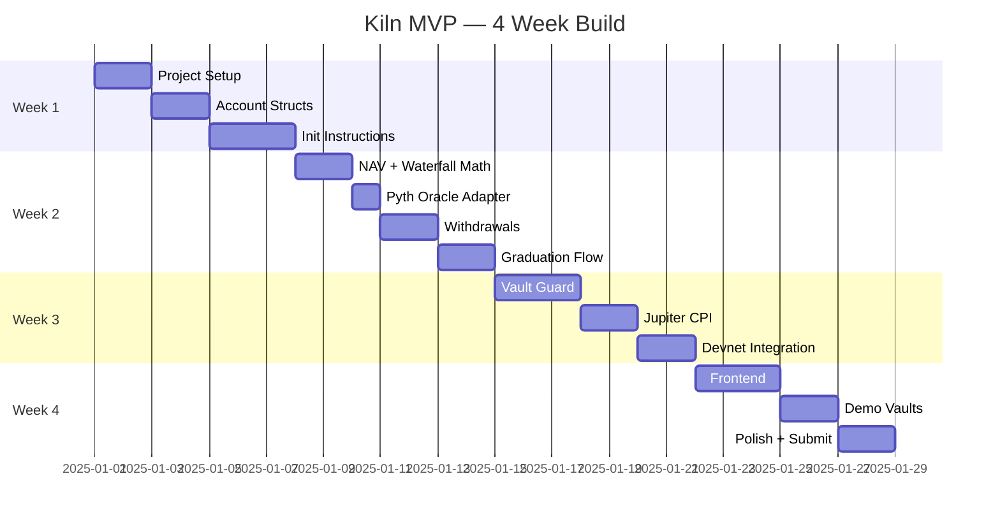

# Kiln — Project Tickets
> Sprint tracker | 4-week MVP build | Update status as you go

---

## Status Legend
| Symbol | Meaning |
|---|---|
| `[ ]` | Not started |
| `[~]` | In progress |
| `[x]` | Done |
| `[!]` | Blocked |

---

## Epic Overview



---

## WEEK 1 — Foundation

### EPIC-01: Project Setup
> Get the dev environment and project skeleton running

- [ ] **KLN-001** — Init Anchor 0.31.1 workspace (`anchor init kiln`)
- [ ] **KLN-002** — Configure `Anchor.toml` for devnet + Helius RPC
- [ ] **KLN-003** — Add `overflow-checks = true` in workspace `Cargo.toml`
- [ ] **KLN-004** — Add `idl-build` feature flag in program `Cargo.toml`
- [ ] **KLN-005** — Add dependencies: `anchor-spl`, `pyth-solana-receiver-sdk`, `jupiter-cpi`
- [ ] **KLN-006** — Configure Solana CLI to use Agave 2.1.0+ (not deprecated `solana-install`)
- [ ] **KLN-007** — Generate program keypair + update `declare_id!`
- [ ] **KLN-008** — Set up Helius devnet RPC endpoint in `.env`

---

### EPIC-02: Account Structs
> Define all on-chain account types

- [ ] **KLN-009** — Define `Vault` account struct with all fields (see arc.md Section 4)
  - [ ] Include `original_junior_deposit` (dynamic limits)
  - [ ] Include `is_paper_mode`, `graduated`, `graduated_at`
  - [ ] Include `cooldown_until`, `rolling_24h_loss_bps`, `rolling_7d_loss_bps`
  - [ ] Include `tier: u8`
- [ ] **KLN-010** — Define `ManagerProfile` account struct
- [ ] **KLN-011** — Define `InvestorPreference` account struct
- [ ] **KLN-012** — Calculate and set correct `space` for all accounts
- [ ] **KLN-013** — Define PDA seeds for each account type
  - `Vault`: `[b"vault", manager.key().as_ref()]`
  - `ManagerProfile`: `[b"manager", owner.key().as_ref()]`
  - `InvestorPreference`: `[b"pref", investor.key().as_ref(), vault.key().as_ref()]`
  - `Treasury`: `[b"treasury", vault.key().as_ref()]`
- [ ] **KLN-014** — Define all custom error codes (`ErrorCode` enum)
  - `VaultNotGraduated`, `VaultInCooldown`, `VaultFrozen`, `JuniorRatioViolation`
  - `OracleStale`, `SlippageExceeded`, `MintNotWhitelisted`, `PositionTooLarge`
  - `MinDepositNotMet`, `TradingDisabled`, `InsufficientJuniorCapital`

---

### EPIC-03: Init Instructions
> First working instructions on localnet

- [ ] **KLN-015** — `init_manager` instruction
  - Creates `ManagerProfile` PDA
  - Sets `owner`, `created_at`, zeroed stats
- [ ] **KLN-016** — `create_vault` instruction
  - Creates `Vault` PDA
  - Inits Junior + Senior SPL mints (PDA as mint authority)
  - Inits USDC treasury token account (PDA owned)
  - Sets `is_paper_mode = true`, `graduated = false`
  - Sets `trading_enabled = true` (paper trades allowed)
  - Sets `tier = 1`
- [ ] **KLN-017** — `deposit_junior` instruction
  - Transfer USDC from trader → treasury
  - Mint J-shares to trader at current share price (or 1:1 on first deposit)
  - Set `original_junior_deposit` on first deposit
  - Update `junior_capital`, `junior_shares`
  - Works in both paper mode and graduated mode
- [ ] **KLN-018** — Unit tests for KLN-015, KLN-016, KLN-017 (localnet)
- [ ] **KLN-019** — Verify full deposit flow end-to-end on localnet

---

## WEEK 2 — Accounting + Withdrawals + Graduation

### EPIC-04: NAV Math + Oracle
> The core accounting engine

- [ ] **KLN-020** — Implement waterfall loss logic as pure Rust function
  ```rust
  fn apply_loss(vault: &mut Vault, loss: u64) { ... }
  ```
- [ ] **KLN-021** — Implement sliding scale junior ratio function
  ```rust
  fn min_junior_ratio_bps(total_capital: u64) -> u16 { ... }
  ```
- [ ] **KLN-022** — Implement dynamic position limit function
  ```rust
  fn max_position_bps(junior_health_bps: u16) -> u16 { ... }
  ```
- [ ] **KLN-023** — `update_nav` instruction
  - Read `PriceUpdateV2` accounts from Pyth pull oracle
  - Check staleness: `get_price_no_older_than(clock, 60, feed_id)`
  - Recompute NAV from current token holdings
  - Apply waterfall if loss detected
  - Update `vault.last_nav`
  - Emit `NAVUpdated` event
  - Trigger auto-freeze if `junior_capital == 0`
- [ ] **KLN-024** — Implement `emit!()` for all on-chain events (see arc.md Section 5.6)
- [ ] **KLN-025** — Unit tests for waterfall math (normal loss, junior wipe, senior hit)
- [ ] **KLN-026** — Unit tests for sliding ratio at each TVL tier
- [ ] **KLN-027** — Unit tests for dynamic position limit at each health tier

---

### EPIC-05: Withdrawals
> Investors and traders can exit correctly

- [ ] **KLN-028** — `deposit_senior` instruction
  - Gate: `require!(vault.graduated, VaultNotGraduated)`
  - Gate: `require!(deposit_amount >= 10_000_000, MinDepositNotMet)` (min $10 USDC, 6 decimals)
  - Check sliding scale junior ratio post-deposit
  - Mint S-shares at current senior share price
  - Record `deposited_at` in `InvestorPreference` if preference account passed
  - Emit `NAVUpdated`
- [ ] **KLN-029** — `withdraw_senior` instruction
  - Burn S-shares
  - Transfer USDC from treasury → investor
  - 24h cooldown: `require!(now >= deposited_at + 86400, VaultInCooldown)`
  - **Skip cooldown if junior ratio < 2000bps (20%)** — instant exit
  - Emit `JuniorBufferLowAlert` if ratio < 20%
- [ ] **KLN-030** — `withdraw_junior` instruction
  - Burn J-shares
  - Check ratio stays ≥ min after withdrawal
  - Block if in paper mode and only depositor
- [ ] **KLN-031** — `freeze_vault` auto-trigger
  - Called internally from `update_nav` when `junior_capital == 0`
  - Sets `trading_enabled = false`
  - Emit `VaultFrozen`
- [ ] **KLN-032** — `set_investor_pref` instruction
  - Creates or updates `InvestorPreference` PDA
  - Stores `alert_threshold_bps`
- [ ] **KLN-033** — Unit tests for withdrawal with cooldown
- [ ] **KLN-034** — Unit tests for instant withdrawal when junior < 20%
- [ ] **KLN-035** — Unit tests for junior withdrawal ratio guard

---

### EPIC-06: Graduation + Fees
> Paper mode exit and performance fees

- [ ] **KLN-036** — `graduate_vault` instruction
  - Callable by anyone after 30 days
  - Check: `now >= vault.created_at + 30 * 86400`
  - Check: `junior_capital > 0`
  - Check: `last_nav > original_junior_deposit` (positive PnL)
  - Set `vault.graduated = true`, `vault.graduated_at = now`
  - Emit `VaultGraduated`
- [ ] **KLN-037** — HWM tracking in `update_nav`
  - Set `high_water_mark = last_nav` on `create_vault`
  - Never update HWM downward
- [ ] **KLN-038** — `claim_fees` instruction
  - Gate: `vault.graduated == true`
  - Calculate profit above HWM
  - `fee_usdc = profit * 20 / 100`
  - Convert to J-shares at current junior share price
  - Mint J-shares to manager
  - Update `high_water_mark = current_nav`
- [ ] **KLN-039** — Unit tests: graduation conditions (too early, loss, success)
- [ ] **KLN-040** — Unit tests: fee calculation above HWM, no fee on recovery
- [ ] **KLN-041** — Integration: full lifecycle test (paper → graduate → deposit senior → trades → fees)

---

## WEEK 3 — Trading Layer

### EPIC-07: Vault Guard
> All pre-swap risk checks

- [ ] **KLN-042** — Implement `vault_guard` module
- [ ] **KLN-043** — Check: input + output mints in `vault.allowed_mints`
- [ ] **KLN-044** — Check: target program == Jupiter program ID (hardcoded constant)
- [ ] **KLN-045** — Check: `vault.trading_enabled == true`
- [ ] **KLN-046** — Check: `vault.junior_capital > 0`
- [ ] **KLN-047** — Check: `now >= vault.cooldown_until` (cooldown not active)
- [ ] **KLN-048** — Check: position size ≤ dynamic limit (from `max_position_bps(junior_health)`)
- [ ] **KLN-049** — Check: slippage ≤ 0.5% vs Pyth oracle price
  - Fetch Pyth price for both input/output mint
  - Compare expected vs quoted price
- [ ] **KLN-050** — Check: paper mode gate (senior deposits not involved — allow)
- [ ] **KLN-051** — Implement trade cooldown update logic post-swap
  - If NAV drops > 3% from this trade → set `cooldown_until = now + 7200`
  - Update `rolling_24h_loss_bps` checkpoint
  - If 24h rolling > 700bps → set `cooldown_until = now + 86400`
  - Update `rolling_7d_loss_bps` checkpoint
  - If 7d rolling > 1500bps → set `cooldown_until = now + 259200` + emit alert
- [ ] **KLN-052** — Unit tests for each Vault Guard check in isolation
- [ ] **KLN-053** — Unit tests for cooldown trigger scenarios

---

### EPIC-08: Jupiter CPI + Execute Swap
> The actual trade execution

- [ ] **KLN-054** — `execute_swap` instruction skeleton
  - Accept `in_amount`, `minimum_amount_out`, `route_plan` args
  - Pass `remaining_accounts` for Jupiter's dynamic routing
- [ ] **KLN-055** — Run all Vault Guard checks (EPIC-07) at start of `execute_swap`
- [ ] **KLN-056** — Build Jupiter CPI call using `jupiter-cpi` crate
  - Use `SharedAccountsRoute` account struct
  - Sign with vault treasury PDA seeds (`invoke_signed`)
- [ ] **KLN-057** — Post-swap: observe vault delta (NOT instruction amount)
  ```rust
  let before = treasury.amount;
  // CPI
  treasury.reload()?;
  let received = treasury.amount - before;
  require!(received >= minimum_amount_out, SlippageExceeded);
  ```
- [ ] **KLN-058** — Call `update_nav` internally after swap
- [ ] **KLN-059** — Apply cooldown logic from KLN-051 post-swap
- [ ] **KLN-060** — Integration test: `execute_swap` on devnet with real Jupiter quote
- [ ] **KLN-061** — Integration test: `execute_swap` rejected by Vault Guard (position too large)
- [ ] **KLN-062** — Integration test: `execute_swap` rejected by Vault Guard (non-whitelisted mint)
- [ ] **KLN-063** — Integration test: cooldown triggered, subsequent swap rejected

---

## WEEK 4 — Frontend + Demo

### EPIC-09: Frontend Core
> Next.js app wired to the program

- [ ] **KLN-064** — Next.js 14 project init (app router, TypeScript, Tailwind)
- [ ] **KLN-065** — Solana Wallet Adapter setup (Phantom + Backpack)
- [ ] **KLN-066** — Anchor client setup (`@coral-xyz/anchor` + generated IDL types)
- [ ] **KLN-067** — Helius RPC provider config (devnet)
- [ ] **KLN-068** — Pyth frontend lib setup (`@pythnetwork/pyth-solana-receiver` + `@pythnetwork/hermes-client`)
- [ ] **KLN-069** — Vault list page `/`
  - Fetch all vault PDAs
  - Display: vault name, TVL, junior health %, status badge (Paper / Active / Cooldown / Frozen)
  - Sort by TVL descending
- [ ] **KLN-070** — Vault detail page `/vault/[id]`
  - NAV chart (line chart, last 30 data points from on-chain events)
  - Junior health meter (color: green > 50%, yellow 20-50%, red < 20%)
  - Trade history table
  - Status badge
  - Deposit senior form (amount input + confirm)
  - Withdraw senior button (shows cooldown timer OR instant if eligible)
- [ ] **KLN-071** — Manager dashboard `/manager`
  - Create vault form
  - Paper mode countdown timer
  - Graduate vault button (enabled when conditions met)
  - Execute swap form (token in, token out, amount → fetches Jupiter quote → executes)
  - Claim fees button
  - Junior health bar with position limit display
- [ ] **KLN-072** — LP dashboard `/lp`
  - My deposits across vaults
  - Withdraw buttons per vault
  - Alert threshold setter per vault
- [ ] **KLN-073** — Manager profile page `/profile/[address]`
  - On-chain history: total PnL, vaults managed, junior burned

---

### EPIC-10: Real-Time Events
> Helius webhook → live UI

- [ ] **KLN-074** — Set up Helius webhook subscription for program events on devnet
- [ ] **KLN-075** — Parse `JuniorHealthChanged`, `CooldownEntered`, `VaultFrozen`, `NAVUpdated`
- [ ] **KLN-076** — Frontend subscribes to event stream (WebSocket or polling)
- [ ] **KLN-077** — Junior health meter updates in real time without page refresh
- [ ] **KLN-078** — Status badge updates in real time (Cooldown countdown timer)

---

### EPIC-11: Demo Vaults
> Two seeded vaults for the pitch

- [ ] **KLN-079** — Seed **Vault A (Profitable)**
  - Manager keypair funded on devnet
  - Deposit $15k junior USDC (airdropped)
  - Run 30 days' worth of profitable paper trades (simulate with localnet time warp)
  - Graduate vault
  - Deposit $85k senior USDC
  - Execute profitable spot trades (SOL/USDC, JUP/USDC)
  - Verify fee crystallization works (J-shares minted to manager)
- [ ] **KLN-080** — Seed **Vault B (Losing)**
  - Deposit $20k junior, $80k senior (graduated)
  - Execute losing trades in sequence
  - Verify health bar drops through each tier
  - Verify position limits tighten
  - Verify instant withdrawal enabled at < 20% junior
  - Verify vault freezes at junior = 0
  - Verify senior withdraws full $80k
- [ ] **KLN-081** — Write demo script / run-through notes for live demo

---

### EPIC-12: Polish + Submission
> Final cleanup and deliverables

- [ ] **KLN-082** — Error handling on all frontend forms (tx failures, wallet not connected)
- [ ] **KLN-083** — Loading states on all async actions
- [ ] **KLN-084** — Mobile-responsive layout check
- [ ] **KLN-085** — README.md (setup guide, architecture summary, demo instructions)
- [ ] **KLN-086** — Record 3-minute demo video (Vault B loss demo + Vault A gain demo)
- [ ] **KLN-087** — 10-slide pitch deck
  - Slide 1: Problem
  - Slide 2: Solution (one-liner)
  - Slide 3: How it works (flow diagram)
  - Slide 4: The two-tranche mechanic
  - Slide 5: Patched incentives (dynamic limits, cooldowns, graduation)
  - Slide 6: Demo screenshots
  - Slide 7: Tech stack
  - Slide 8: Differentiation vs Drift Vaults / dHEDGE
  - Slide 9: 4-week build (what shipped)
  - Slide 10: What's next (Drift perps, Tier 2, governance)
- [ ] **KLN-088** — Final devnet deploy + verify program ID in README
- [ ] **KLN-089** — Submit

---

## Out of Scope (Post-MVP Backlog)

| Ticket | Feature |
|---|---|
| KLN-B001 | Drift perps integration (Tier 2) |
| KLN-B002 | Tier 2 upgrade instruction + governance |
| KLN-B003 | TWAP pricing |
| KLN-B004 | Multisig governance |
| KLN-B005 | Quarterly fee crystallization |
| KLN-B006 | Full quantitative reputation score |
| KLN-B007 | Protocol co-investment program |
| KLN-B008 | Mobile app |
| KLN-B009 | Audit |
| KLN-B010 | Mainnet deploy |

---

## Progress Summary

```
Week 1:  [ ] 0/19 tickets
Week 2:  [ ] 0/22 tickets
Week 3:  [ ] 0/14 tickets
Week 4:  [ ] 0/26 tickets
───────────────────────────
Total:   [ ] 0/81 tickets
```

> Update this block manually as tickets complete.
